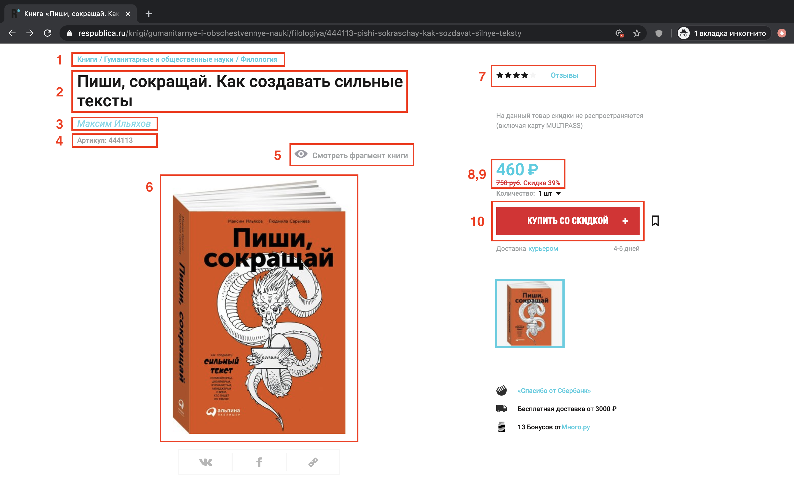
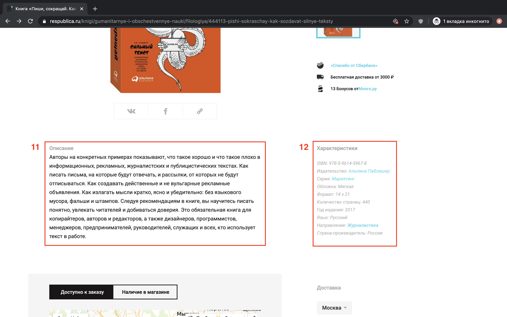

# Домашнее задание №3

В этом задании требуется обкачать книжный магазин ["Республика"](https://www.respublica.ru/) с использованием библиотек [BeautifulSoup](https://www.crummy.com/software/BeautifulSoup/bs4/doc/) и [lxml](https://lxml.de/). Ваша программа должна скачать информацию обо всех книгах в магазине следующих авторов, [см. список](authors.txt).

Результатом работы вашей программы должен быть файл `hw_3.csv` с таблицей из всех найденных книг.

## Общий подход к решению задачи

Задачу условно можно разделить на два этапа. На первом этапе требуется получить все ссылки на книги автора, на втором — получить информацию о каждой из книг.

### Этап 1. Получение ссылок на книги автора

Для поиска всех книг автора мы будем пользоваться специально подготовленными страницами на сайте магазина. Формат URL-ов страниц имеет вид:
```
https://www.respublica.ru/authors/{author_id}
```
где вместо `{author_id}` подставляется id автора.

[Список id-шников](authors.txt) требуемых авторов.

### Этап 2. Получение информации о книгах

Рассмотрим в качестве примера [карточку](https://www.respublica.ru/knigi/gumanitarnye-i-obschestvennye-nauki/filologiya/444113-pishi-sokraschay-kak-sozdavat-silnye-teksty) книги Максима Ильяхова "Пиши, сокращай. Как создавать сильные тексты".




На скриншотах выделены 12 областей, из каждой области требуется извлечь следующие элементы:
1. поле "Категория" (категории перечисленные через точку с запятой);
2. поле "Название";
3. поле "Автор" (если авторов несколько, укажите всех через точку с запятой);
4. поле "ID" (артикул карточки);
5. поле "Превью" (полный абсолютный путь до pdf-фрагмента книги);
6. поле "Изображение" (полный абсолютный путь);
7. поле "Оценка", "Число отзывов", "Число оценок" (исследуйте выделенный элемент);
8. поле "Цена" (число не должно содержать пробелов внутри себя);
9. поле "Цена (старая)" (если имеется скидка на товар);
10. поле "Наличие" (индикатор, что книга есть в магазине);
11. описание книги;
12. все поля из таблицы.

Таким образом карточка из примера представима в виде следующего словаря:
```json
{
    "ID": "444113",
    "URL": "https://www.respublica.ru/knigi/gumanitarnye-i-obschestvennye-nauki/filologiya/444113-pishi-sokraschay-kak-sozdavat-silnye-teksty",
    "Название": "Пиши, сокращай. Как создавать сильные тексты",
    "Автор": "Максим Ильяхов",
    "Превью": "https://www.respublica.ru/items/319412/download_preview_pdf",
    "Изображение": "https://www.respublica.ru/uploads/01/00/00/6e/ov/fullscreen_888e55eb57676e2d.jpg",
    "Описание": "Авторы на конкретных примерах показывают, что такое хорошо и что такое плохо в информационных, рекламных, журналистских и публицистических текстах. Как писать письма, на которые будут отвечать, и рассылки, от которых не будут отписываться. Как создавать действенные и не вульгарные рекламные объявления. Как излагать мысли кратко, ясно и убедительно: без языкового мусора, фальши и штампов. Следуя рекомендациям в книге, вы научитесь писать понятно, увлекать читателей и добиваться доверия. Это обязательная книга для копирайтеров, авторов и редакторов, а также дизайнеров, программистов, менеджеров, предпринимателей, руководителей, служащих и всех, кто использует текст в работе.",
    "Цена": 460,
    "Цена (старая)": 750,
    "В наличии": true,
    "Категория": "Книги; Гуманитарные и общественные науки; Филология",
    "Число отзывов": 29.0,
    "Число оценок": 29.0,
    "Оценка": 4.820689655172414,
    "ISBN": "978-5-9614-5967-8",
    "Издательство": "Альпина Паблишер",
    "Серия": "Маркетинг",
    "Обложка": "Мягкая",
    "Формат": "14 х 21",
    "Количество страниц": "440",
    "Год издания": "2017",
    "Язык": "Русский",
    "Направление": "Журналистика",
    "Страна-производитель": "Россия"
}
```
Обратите внимание, что некоторые поля из таблицы, например: "Вес, г", "Иллюстратор" — отсутствуют именно для этой карточки, но могут присутствовать в других карточках, см. таблицы, например, [карточки #1](https://www.respublica.ru/knigi/hudozhestvennaya-literatura/sovremennaya-proza/493958-bezdna) и [карточки #2](https://www.respublica.ru/detyam/detskie-knigi/hudozhestvennaya-literatura/132520-priklyucheniya-neznayki-i-ego-druzey).

Предположим, что у нас есть функция `process_page(url)`, которая для карточки с ссылкой `url` возвращает описанный выше словарь. Тогда требуемую таблицу можно получить следующим образом:
```python
import pandas as pd

result = list(map(process_page, urls))
df = pd.DataFrame(result)
df.sort_values(by=['ID'], inplace=True)

with open('data/hw_3.csv', mode='w', encoding='utf-8') as f_csv:
    df.to_csv(f_csv, index=False)
```

Пример результата работы программы можно найти [здесь](hw3_sample.csv).

## Общие рекомендации по выполнению задания

1. В данном задании вы строите небольшую, но все же, систему для обкачки сайтов. Поэтому полезно логировать ее состояние, например, писать сколько книг уже было обработано. Для этого можно пользоваться библиотекой [tqdm](https://tqdm.github.io/). 
2. Не смешивайте этапы задания вместе. Сначала получите все url-ы карточек для всех авторов, а затем для каждой карточки извлеките требуемую информацию.
3. Используйте возможности параллельной работы с данными Python, например, модуль multiprocessing.
4. Помните, что парсинг страниц очень нестабильный процесс, поэтому требуется сделать ваш код максимально безопасным: явно проверять извлечение каждого из полей (делать соответствующие проверки), проверять что страница скачана (если страница не скачана, то попробовать ее перекачать) и т.п.
5. Старайтесь не искать каждый элемент по ВСЕЙ странице. Если элементы расположены в одном блоке, то лучше сначала найти этот блок, а затем элементы уже внутри этого блока.